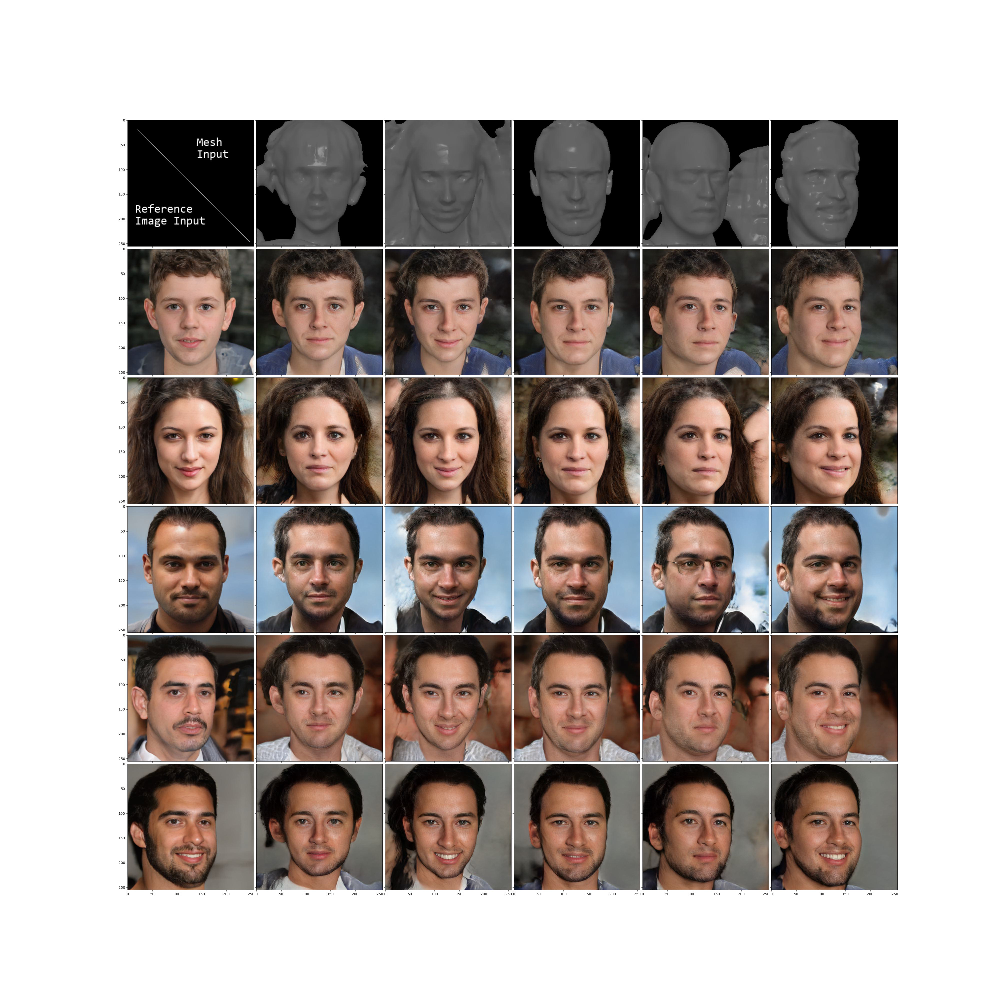
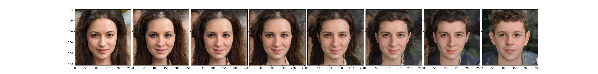

# Neural 3D Face Rendering conditioned on 2D appearance via GAN Disentanglement Method

 we propose a method for rendering 2D images of 3D face meshes directly controlled by a single 2D reference image, using GAN disentanglement. Our approach involves an input of a 3D mesh and a reference image, where encoders extract geometric features from the mesh and appearance features from the reference image. These features control the StyleGAN2 generator to obtain a generated image that preserves the 3D mesh's geometry and the reference image's appearance.
## Requirements 
We recommend using Ubuntu for better pytorch3D installation experience.

Our CUDA Kit: cudatoolkit=11.6.0

This project comes with a requirements.txt file. please install them with conda command:

`conda env create -f environment.yml`

This will create a conda environment named "GeoFaceTest".

### Tips:
Install pytorch3d using following commands from https://github.com/facebookresearch/pytorch3d/blob/main/INSTALL.md
if installation method above failed.

`conda install -c fvcore -c iopath -c conda-forge fvcore iopath`

`conda install -c bottler nvidiacub`

`conda install pytorch3d -c pytorch3d`

### Before Running
Please merge all these files into the project before first running.

#### Pretrained Models
Put these models into `data/tmp/train_2022_11_08_23_23_05_test_24_wzhwjaw_NOflip_CONTEX/models`

Google Drive:
https://drive.google.com/file/d/1tXuMbR3I28wTf1Xvxjh7tzWlYidAVvdy/view?usp=drive_link

BaiduNetDisk：https://pan.baidu.com/s/1Oy6lNVHZ3RQe6TMYOEIlBA?pwd=vwga 
Password：vwga 

#### Test Dataset 
Download and merge this folder into your cloned repository. It includes pretrained data of net modules
and generated Training set of 5 identity and 1000 identity.

Google Drive:https://drive.google.com/file/d/1c4bLHkM4g6u53r7X6tcS9HJXShkJB2lc/view?usp=drive_link

BaiduNetDisk：https://pan.baidu.com/s/1AD_McQZK-DY4e3BIvX1xDQ?pwd=r2y7 
Password：r2y7

## Visualization

To reproduce these images, please complete model download and put them to the right place.
`python DemoImageUtils_V3_Gnew.py`

## Training

### Start Training
Train with default setting use this command:

`python train_V10_4_StyleGAN2_Unpaired_FFHQ_256_lndloss+GEnew.py --expname test --wandb`

Activate wandb logging with
`--wandb `

Set dataset path with 
`--dataset_path ./datasets/FFHQ_SDF_Test_5_fixed_angles `

To load pretrained weights from checkpoint dir

`python train_V10_4_StyleGAN2_Unpaired_FFHQ_256_lndloss+GEnew.py --continue_training --checkpoints_dir train_2022_08_24_16_56_23_debug --ch
eckpoints_epoch 20`

Checkpoints will be saved to "./data/tmp/{train_name}_{time}/models/"

### Parallel Training

Debug training with no wandb info, 4 processes. 

`python -m torch.distributed.run --nnodes=1 --nproc_per_node=4 --master_addr="127.0.0.1" --master_port=$RANDOM train_V10_4_ddp.py --dataset_path ./datasets/FFHQ_SDF_Test_5_fixed_angles --expname debug --pretrained_stylegan2 --epoch 20`

Training with 1000 identity.

`python -m torch.distributed.run --nnodes=1 --nproc_per_node=4 --master_addr="127.0.0.1" --master_port=$RANDOM train_V10_4_ddp.py --dataset_path ./datasets/FFHQ_SDF_Small_1000 --expname train_Small_1000 --epoch 20 --wandb`

